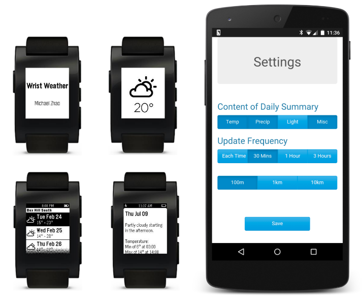

# Wrist Weather

## Screenshots

## About

This is a [Pebble](https://en.wikipedia.org/wiki/Pebble_(watch)) smartwatch app I developed in 2015, and published on the now-defunct Pebble App Store.

The app was written in JavaScript using the [Pebble.js](https://pebble.github.io/pebblejs/) framework. The app leveraged [Dark Sky API](https://darksky.net/dev) (formerly forecast.io) for weather data, and [Google Maps Geocoding API](https://developers.google.com/maps/documentation/geocoding/start) for address data.

The app featured a minimal and customisable UI, and navigation was intuitive through the three buttons on the right side of all Pebble smartwatches.

Users were able to customise app settings through this accompanying [settings website](https://myzo.github.io/wrist-weather-settings), which was stylised using Bootstrap.

Note: [myzo](https://github.com/myzo) was the Github account I used to host the [settings website](https://github.com/myzo/wrist-weather-settings).
